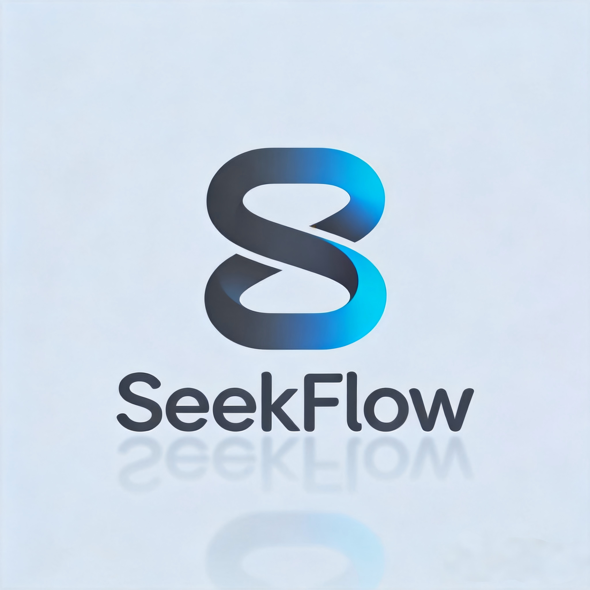

<p align="center">

**Language / 语言 / 語言**

[**简体中文**](README.md) | [**English**](README.en.md)

</p>

---

<p align="center">
  
</p>

<p align="center">
  <em>Seek the flow, let it grow.</em>
</p>

<p align="center">
  <a href="https://www.npmjs.com/package/seekflow"></a>
  <a href="https://www.npmjs.com/package/seekflow"></a>
  <a href="https://github.com/xiaHatecilantro/seekflow/blob/main/LICENSE"></a>
  <a href="https://nodejs.org"></a>
  
</p>

---

## Origin

It started with a coincidence.

I was studying other people's vibecoding projects on GitHub and wanted a structured workflow to lay the foundation for my own. I was stuck comparing [ECC](https://github.com/affaan-m/ECC) and [Superpowers](https://github.com/obra/superpowers) — one a massive arsenal, the other a strict discipline system — unsure which to commit to.

Then DeepSeek told me neither would work well:

> "You're using the DeepSeek API, not Anthropic's official API. ECC and Superpowers are built on assumptions about Claude models (Opus/Sonnet/Haiku routing strategies, skill behaviors tied to model-specific traits, etc.). Using them directly may degrade the experience."

(I'm on the Claude Code + DeepSeek v4 bandwagon, haven't tried Resonix or DeepSeek TUI yet.)

So I had an idea — let DeepSeek build me a system, following the blueprints of those two mature projects but optimized for its own strengths. Some personal touches found their way in: a `mcp-manager` skill I'd previously crafted, and a negative-feedback loop I insisted on.

**That's how SeekFlow was born.** Not a stripped-down ECC. Not a clone of Superpowers. It's something that grew in DeepSeek's native soil — a workflow system that learns from its mistakes.

Fork and personalize as you see fit.

---

## Install

**No clone. No config.**

```bash
npx seekflow
```

Automatically detects your installed AI coding tools and interactively installs.

```bash
npx seekflow claude      # Claude Code only
npx seekflow codex       # Codex only
npx seekflow cursor      # Cursor only
npx seekflow all         # All detected tools
npx seekflow list        # List available tools
npx seekflow uninstall   # Remove
```

| Supported | Claude Code | Codex | Cursor | Gemini CLI | OpenCode |
|:---|:---:|:---:|:---:|:---:|:---:|

---

## What's Inside

### 9 Agents

| Agent | Role | Model |
|:---|:---|:---:|
| `planner` | Feature planning | Pro |
| `architect` | Architecture decisions | Pro |
| `frontend-engineer` | Frontend architecture, routing, state, ports | Pro |
| `backend-engineer` | API design, database, services, middleware | Pro |
| `code-reviewer` | Code & security review | Pro |
| `debugger` | Systematic debugging | Pro |
| `tdd-executor` | RED → GREEN → REFACTOR | Pro |
| `refactorer` | Safe refactoring | Pro |
| `doc-updater` | Doc sync | Flash |

### 9 Skills

| Skill | Description |
|:---|:---|
| `brainstorming` | Socratic requirement clarification |
| `writing-plans` | Atomic task decomposition (2-5 min each) |
| `tdd-workflow` | Strict RED-GREEN-REFACTOR cycle |
| `code-review` | 4-axis review (security, correctness, maintainability, simplicity) |
| `continuous-improvement` | **Self-evolving negative-feedback loop** |
| `session-retro` | End-of-session retrospective |
| `model-routing` | Flash/Pro smart routing |
| `deepseek-context` | 1M context optimization |
| `mcp-manager` | MCP server management |

### 6 Hooks

| Hook | Trigger | Action |
|:---|:---|:---|
| `SessionStart` | Session begins | Smart-load learned rules |
| `PostToolUse` | After file edit | Remind tests & docs |
| `PreToolUse` | Before dangerous command | Block rm -rf / force push / DROP TABLE |
| `SessionEnd` | Session ends | Stats & retro reminder |
| `Stop` | AI pauses | Taskbar flash + warn check |
| `Elicitation` | AI asks question | Taskbar flash |
| `PermissionRequest` | Permission prompt | Taskbar flash |
| `PreCompact` | Before context compaction | Protect learned state |

### Rules — Tiered Loading

**Domain rules live inside agents & skills, loaded on demand. No startup bloat.**

| Tier | Content | Loads When |
|:---|:---|:---|
| Root | `CLAUDE.md` + `rules/core.md` | Every session |
| Agent | Agent-embedded principles | Agent invoked |
| Skill | Skill-embedded methods | Skill triggered |
| Learned | Tagged learned rules | Context-matched |

Startup footprint: ~60 lines. Won't bloat as learned rules grow.

### Decision Log

Every important decision (direction, architecture, method) is saved to `.claude/memory/MEMORY.md` and loaded on session start. After architecture discussions, `.claude/memory/PROJECT-SPEC.md` locks in the technical roadmap.

---

## Highlight: Negative-Feedback Loop

**Never make the same mistake twice.**

ECC and Superpowers are static — they stay the same after install. SeekFlow evolves:

```
You say "No, don't use X, use Y"
  → Detect correction
    → Auto-draft rule
      → Ask confirmation
        → Write → permanent
```

Learned rules are tagged and tiered — `general` loads at startup, domain tags (e.g. `python`, `git`) load on demand. No startup bloat no matter how many rules you accumulate.

Neither ECC nor Superpowers has this capability.

---

## Comparison

| | ECC | Superpowers | **SeekFlow** |
|:---|:---|:---|:---|
| Position | Arsenal | Discipline | **Self-evolving workflow** |
| Agents | 36+ | ~5 | 9 |
| Skills | 249 | 14 | 9 |
| Model optimized | Claude | Claude | **DeepSeek** |
| Negative-feedback | No | No | **Yes** |
| Chinese-native | Translation | No | **Yes** |
| Context | 200K conservative | 200K conservative | **1M full use** |
| Rules architecture | Flat all-load | Flat all-load | **Tiered on-demand** |
| Install | Claude Code plugin | Claude Code plugin | **npx universal** |

---

## Requirements

- **Node.js** ≥ 18
- Any AI coding tool: Claude Code · Codex · Cursor · Gemini CLI · OpenCode
- DeepSeek API (recommended) or Anthropic API

---

## Credits

SeekFlow's architecture is deeply inspired by [Everything Claude Code](https://github.com/affaan-m/ECC) and [Superpowers](https://github.com/obra/superpowers). Hats off to both authors.

---

## Contributing

PRs welcome. New agents, skills, rules, or improvements to existing ones — your ideas make SeekFlow better.

**Ideas:**
- New language/framework skills
- Support for more AI tools
- Negative-feedback improvements
- Documentation & translations

Fork → Branch → PR. Got questions? Open an issue.

---

## License

[MIT](LICENSE) · [GitHub](https://github.com/xiaHatecilantro/seekflow)
